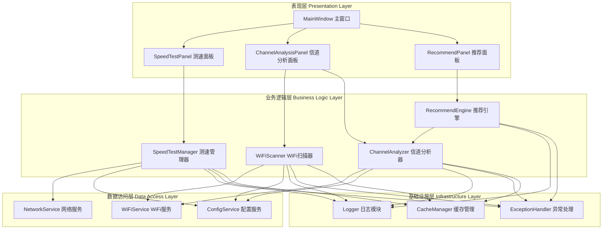
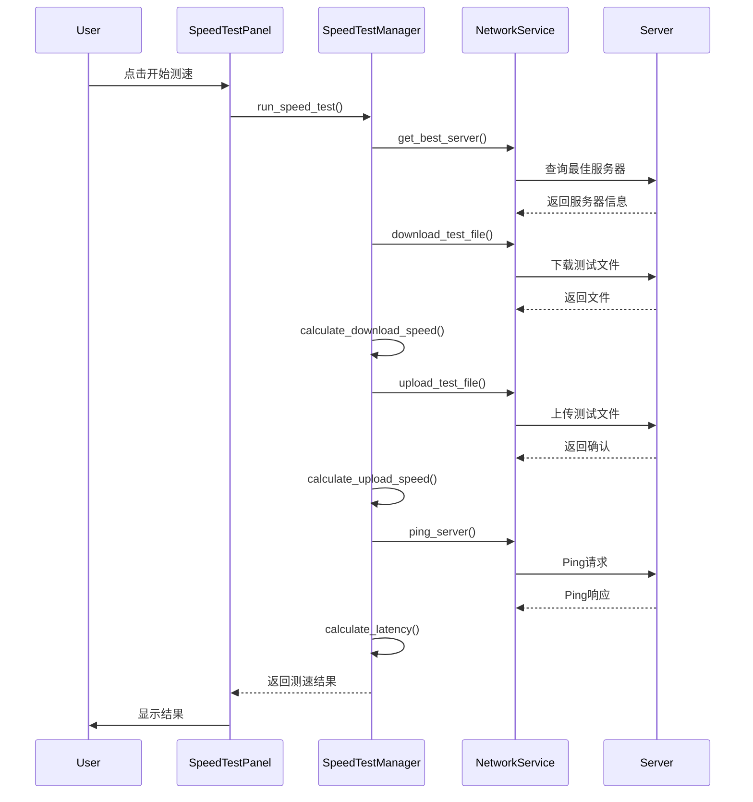
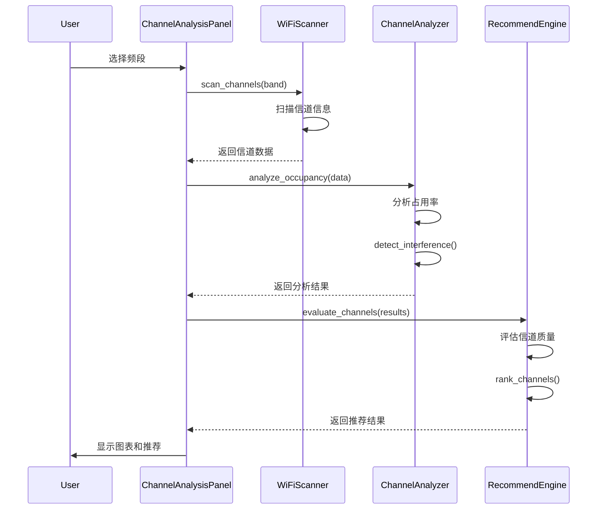

# DESIGN.md - 系统架构设计文档

## 1. 系统架构图



## 2. 模块详细设计

### 2.1 表现层 (Presentation Layer)

#### MainWindow (主窗口)
**职责**：应用程序主入口，管理各功能面板
**主要方法**：
- `__init__()`: 初始化主窗口
- `setup_ui()`: 构建UI界面
- `connect_signals()`: 连接信号槽
- `handle_error()`: 统一错误处理

#### SpeedTestPanel (测速面板)
**职责**：展示网络测速结果，提供测速控制
**主要方法**：
- `start_speed_test()`: 开始测速
- `update_progress()`: 更新进度
- `display_results()`: 显示测速结果
- `save_results()`: 保存测速记录

#### ChannelAnalysisPanel (信道分析面板)
**职责**：展示信道占用情况，支持频段切换
**主要方法**：
- `switch_band()`: 切换频段（2.4GHz/5GHz）
- `update_channel_chart()`: 更新信道图表
- `refresh_data()`: 刷新信道数据
- `display_channel_info()`: 显示信道详情

#### RecommendPanel (推荐面板)
**职责**：展示智能信道推荐结果
**主要方法**：
- `get_recommendation()`: 获取推荐结果
- `display_recommendation()`: 显示推荐信息
- `apply_recommendation()`: 应用推荐信道

### 2.2 业务逻辑层 (Business Logic Layer)

#### SpeedTestManager (测速管理器)
**职责**：管理网络测速流程
**主要方法**：
- `run_download_test()`: 执行下载测试
- `run_upload_test()`: 执行上传测试
- `measure_latency()`: 测量延迟
- `calculate_metrics()`: 计算测速指标

#### WiFiScanner (WiFi扫描器)
**职责**：扫描WiFi网络和信道信息
**主要方法**：
- `scan_networks()`: 扫描可用网络
- `scan_channels()`: 扫描信道信息
- `get_signal_strength()`: 获取信号强度
- `parse_scan_results()`: 解析扫描结果

#### ChannelAnalyzer (信道分析器)
**职责**：分析信道占用和干扰情况
**主要方法**：
- `analyze_occupancy()`: 分析信道占用率
- `detect_interference()`: 检测干扰
- `calculate_quality()`: 计算信道质量
- `generate_report()`: 生成分析报告

#### RecommendEngine (推荐引擎)
**职责**：基于分析结果推荐最优信道
**主要方法**：
- `evaluate_channels()`: 评估信道质量
- `rank_channels()`: 信道排序
- `select_optimal()`: 选择最优信道
- `generate_recommendation()`: 生成推荐结果

### 2.3 数据访问层 (Data Access Layer)

#### NetworkService (网络服务)
**职责**：提供网络测速相关服务
**主要方法**：
- `download_test_file()`: 下载测试文件
- `upload_test_file()`: 上传测试文件
- `ping_server()`: Ping服务器
- `get_best_server()`: 获取最佳服务器

#### WiFiService (WiFi服务)
**职责**：提供WiFi操作相关服务
**主要方法**：
- `connect_to_network()`: 连接到网络
- `disconnect_network()`: 断开网络
- `get_network_info()`: 获取网络信息
- `set_channel()`: 设置信道

#### ConfigService (配置服务)
**职责**：管理应用配置
**主要方法**：
- `load_config()`: 加载配置
- `save_config()`: 保存配置
- `get_setting()`: 获取设置项
- `set_setting()`: 设置配置项

### 2.4 基础设施层 (Infrastructure Layer)

#### Logger (日志模块)
**职责**：统一日志记录
**主要方法**：
- `info()`: 记录信息日志
- `warning()`: 记录警告日志
- `error()`: 记录错误日志
- `debug()`: 记录调试日志

#### ExceptionHandler (异常处理)
**职责**：统一异常处理
**主要方法**：
- `handle_exception()`: 处理异常
- `log_exception()`: 记录异常
- `show_error_dialog()`: 显示错误对话框

#### CacheManager (缓存管理)
**职责**：管理数据缓存
**主要方法**：
- `get()`: 获取缓存
- `set()`: 设置缓存
- `clear()`: 清除缓存
- `is_expired()`: 检查是否过期

## 3. 数据流设计

### 3.1 测速流程


### 3.2 信道分析流程


## 4. 接口定义

### 4.1 测速接口
```python
class ISpeedTestManager:
    def run_speed_test() -> SpeedTestResult
    def cancel_test() -> None
    def get_progress() -> float
```

### 4.2 WiFi扫描接口
```python
class IWiFiScanner:
    def scan_networks() -> List[NetworkInfo]
    def scan_channels(band: str) -> List[ChannelInfo]
    def get_signal_strength(ssid: str) -> int
```

### 4.3 信道分析接口
```python
class IChannelAnalyzer:
    def analyze_occupancy(channels: List[ChannelInfo]) -> Dict
    def detect_interference(channels: List[ChannelInfo]) -> Dict
    def calculate_quality(channel: ChannelInfo) -> float
```

### 4.4 推荐引擎接口
```python
class IRecommendEngine:
    def evaluate_channels(analysis: Dict) -> List[ChannelScore]
    def select_optimal(scores: List[ChannelScore]) -> ChannelRecommendation
```

## 5. 异常处理策略

### 5.1 异常分类
- **网络异常**：网络连接失败、服务器无响应
- **权限异常**：WiFi访问权限不足、管理员权限缺失
- **数据异常**：数据解析失败、数据格式错误
- **UI异常**：界面渲染失败、用户操作异常

### 5.2 处理策略
| 异常类型 | 处理方式 | 用户提示 |
|---------|---------|---------|
| 网络异常 | 重试3次，失败后提示 | "网络连接失败，请检查网络设置" |
| 权限异常 | 提示用户以管理员身份运行 | "需要管理员权限，请以管理员身份运行" |
| 数据异常 | 记录日志，使用默认值 | "数据解析失败，使用默认值" |
| UI异常 | 记录日志，显示错误对话框 | "界面错误，请重启应用" |

## 6. 集成方案

### 6.1 第三方库集成
- **PyQt5**：GUI框架
- **pywifi**：WiFi操作
- **speedtest-cli**：网络测速
- **matplotlib**：图表绘制
- **requests**：HTTP请求

### 6.2 系统API集成
- **netsh命令**：Windows网络配置
- **WLAN API**：无线网络操作

## 7. 性能优化

### 7.1 缓存策略
- 测速结果缓存：缓存最近10次测速结果
- 信道数据缓存：缓存信道分析结果5分钟
- 配置缓存：内存缓存配置信息

### 7.2 异步处理
- 测速操作：使用QThread异步执行
- 信道扫描：使用定时器定期刷新
- 数据更新：使用信号槽机制

## 8. 安全考虑

### 8.1 数据安全
- 不保存用户WiFi密码
- 不上传用户网络信息
- 测速数据本地存储

### 8.2 权限管理
- 最小权限原则
- 提示用户权限需求
- 异常时释放资源
