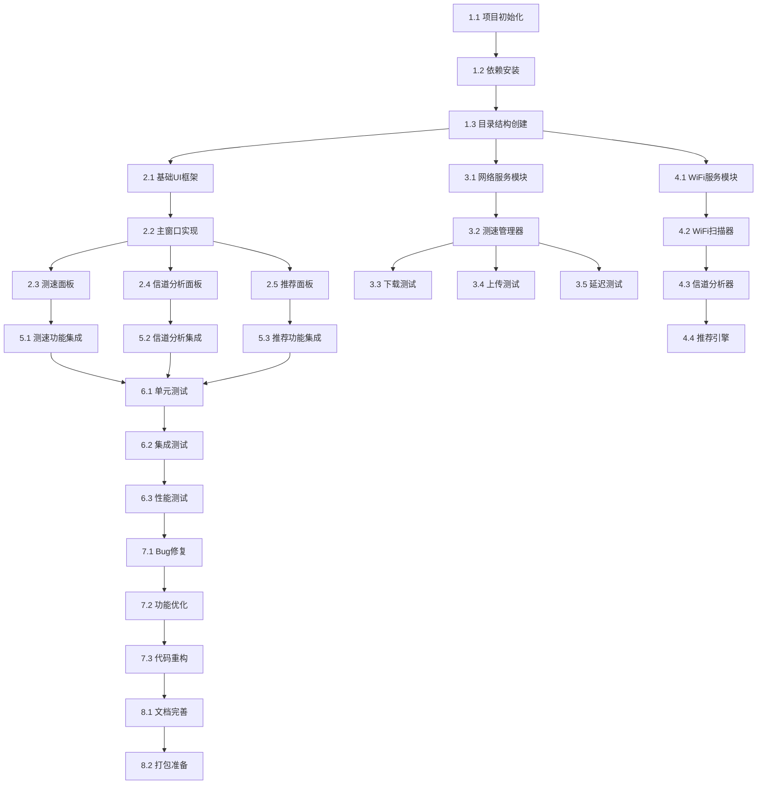

# TASK.md - 任务拆分文档

## 任务依赖关系图

## 任务清单

### 阶段1：项目初始化 (P0 - 必须完成)

#### 1.1 项目初始化
- **任务描述**：创建项目基础文件和配置
- **验收标准**：项目目录结构完整，配置文件正确
- **预估时间**：0.5小时
- **依赖**：无
- **产出**：项目目录、配置文件

#### 1.2 依赖安装
- **任务描述**：安装Python依赖库
- **验收标准**：所有依赖库成功安装，无版本冲突
- **预估时间**：0.5小时
- **依赖**：1.1
- **产出**：requirements.txt、虚拟环境

#### 1.3 目录结构创建
- **任务描述**：创建标准项目目录结构
- **验收标准**：目录结构符合Python项目规范
- **预估时间**：0.5小时
- **依赖**：1.1
- **产出**：src/、tests/、docs/、config/等目录

### 阶段2：UI框架开发 (P0 - 必须完成)

#### 2.1 基础UI框架
- **任务描述**：创建PyQt5基础框架
- **验收标准**：应用可以启动，显示主窗口
- **预估时间**：1小时
- **依赖**：1.3
- **产出**：main.py、app.py

#### 2.2 主窗口实现
- **任务描述**：实现MainWindow主窗口
- **验收标准**：主窗口正常显示，菜单栏、状态栏完整
- **预估时间**：2小时
- **依赖**：2.1
- **产出**：main_window.py

#### 2.3 测速面板
- **任务描述**：实现SpeedTestPanel面板
- **验收标准**：面板UI完整，测速按钮和结果显示区域正常
- **预估时间**：2小时
- **依赖**：2.2
- **产出**：speed_test_panel.py

#### 2.4 信道分析面板
- **任务描述**：实现ChannelAnalysisPanel面板
- **验收标准**：面板UI完整，频段切换和图表显示区域正常
- **预估时间**：2小时
- **依赖**：2.2
- **产出**：channel_analysis_panel.py

#### 2.5 推荐面板
- **任务描述**：实现RecommendPanel面板
- **验收标准**：面板UI完整，推荐信息显示区域正常
- **预估时间**：1.5小时
- **依赖**：2.2
- **产出**：recommend_panel.py

### 阶段3：网络测速模块 (P0 - 必须完成)

#### 3.1 网络服务模块
- **任务描述**：实现NetworkService基础服务
- **验收标准**：可以发起HTTP请求，处理响应
- **预估时间**：1.5小时
- **依赖**：1.3
- **产出**：network_service.py

#### 3.2 测速管理器
- **任务描述**：实现SpeedTestManager管理器
- **验收标准**：可以管理测速流程，处理进度更新
- **预估时间**：2小时
- **依赖**：3.1
- **产出**：speed_test_manager.py

#### 3.3 下载测试
- **任务描述**：实现下载速度测试
- **验收标准**：可以准确测量下载速度，误差<10%
- **预估时间**：2小时
- **依赖**：3.2
- **产出**：download_test.py

#### 3.4 上传测试
- **任务描述**：实现上传速度测试
- **验收标准**：可以准确测量上传速度，误差<10%
- **预估时间**：2小时
- **依赖**：3.2
- **产出**：upload_test.py

#### 3.5 延迟测试
- **任务描述**：实现网络延迟测试
- **验收标准**：可以准确测量延迟，误差<5ms
- **预估时间**：1.5小时
- **依赖**：3.2
- **产出**：latency_test.py

### 阶段4：WiFi分析模块 (P0 - 必须完成)

#### 4.1 WiFi服务模块
- **任务描述**：实现WiFiService基础服务
- **验收标准**：可以获取WiFi接口信息
- **预估时间**：1.5小时
- **依赖**：1.3
- **产出**：wifi_service.py

#### 4.2 WiFi扫描器
- **任务描述**：实现WiFiScanner扫描器
- **验收标准**：可以扫描可用WiFi网络和信道信息
- **预估时间**：2.5小时
- **依赖**：4.1
- **产出**：wifi_scanner.py

#### 4.3 信道分析器
- **任务描述**：实现ChannelAnalyzer分析器
- **验收标准**：可以分析信道占用率和干扰情况
- **预估时间**：2小时
- **依赖**：4.2
- **产出**：channel_analyzer.py

#### 4.4 推荐引擎
- **任务描述**：实现RecommendEngine推荐引擎
- **验收标准**：可以推荐最优信道，准确率≥90%
- **预估时间**：2小时
- **依赖**：4.3
- **产出**：recommend_engine.py

### 阶段5：功能集成 (P0 - 必须完成)

#### 5.1 测速功能集成
- **任务描述**：集成测速功能到UI
- **验收标准**：测速功能完整可用，结果显示正确
- **预估时间**：2小时
- **依赖**：2.3, 3.2, 3.3, 3.4, 3.5
- **产出**：集成后的测速模块

#### 5.2 信道分析集成
- **任务描述**：集成信道分析功能到UI
- **验收标准**：信道分析功能完整可用，图表显示正确
- **预估时间**：2.5小时
- **依赖**：2.4, 4.2, 4.3
- **产出**：集成后的信道分析模块

#### 5.3 推荐功能集成
- **任务描述**：集成推荐功能到UI
- **验收标准**：推荐功能完整可用，推荐结果准确
- **预估时间**：1.5小时
- **依赖**：2.5, 4.4
- **产出**：集成后的推荐模块

### 阶段6：测试阶段 (P0 - 必须完成)

#### 6.1 单元测试
- **任务描述**：编写单元测试用例
- **验收标准**：单元测试覆盖率≥80%，所有测试通过
- **预估时间**：4小时
- **依赖**：5.1, 5.2, 5.3
- **产出**：单元测试代码、测试报告

#### 6.2 集成测试
- **任务描述**：编写集成测试用例
- **验收标准**：集成测试全部通过，功能正常
- **预估时间**：3小时
- **依赖**：6.1
- **产出**：集成测试代码、测试报告

#### 6.3 性能测试
- **任务描述**：进行性能测试
- **验收标准**：测速完成时间<30秒，信道分析实时更新
- **预估时间**：2小时
- **依赖**：6.2
- **产出**：性能测试报告

### 阶段7：优化阶段 (P1 - 优先完成)

#### 7.1 Bug修复
- **任务描述**：修复测试中发现的Bug
- **验收标准**：所有已知Bug修复完成
- **预估时间**：3小时
- **依赖**：6.3
- **产出**：Bug修复记录

#### 7.2 功能优化
- **任务描述**：优化用户体验和性能
- **验收标准**：用户操作流畅，性能达标
- **预估时间**：2小时
- **依赖**：7.1
- **产出**：优化后的代码

#### 7.3 代码重构
- **任务描述**：重构代码，提高可维护性
- **验收标准**：代码符合规范，可读性好
- **预估时间**：2小时
- **依赖**：7.2
- **产出**：重构后的代码

### 阶段8：交付准备 (P1 - 优先完成)

#### 8.1 文档完善
- **任务描述**：完善项目文档
- **验收标准**：文档完整，易于理解
- **预估时间**：2小时
- **依赖**：7.3
- **产出**：README.md、用户手册

#### 8.2 打包准备
- **任务描述**：准备打包配置
- **验收标准**：打包配置正确，可以生成exe
- **预估时间**：1.5小时
- **依赖**：8.1
- **产出**：打包脚本、配置文件

## 任务优先级说明

- **P0 (必须完成)**：核心功能，必须完成才能交付
- **P1 (优先完成)**：重要功能，影响用户体验
- **P2 (可选完成)**：增强功能，有时间再完成

## 验收标准汇总

| 任务类型 | 验收标准 |
|---------|---------|
| UI任务 | 界面正常显示，交互流畅 |
| 功能任务 | 功能完整可用，结果准确 |
| 测试任务 | 测试覆盖率≥80%，测试通过 |
| 优化任务 | 性能达标，代码规范 |

## 风险评估

| 任务 | 风险等级 | 应对措施 |
|-----|---------|---------|
| 4.2 WiFi扫描器 | 高 | 提供多种扫描方式备选 |
| 3.3 下载测试 | 中 | 实现多服务器自动切换 |
| 5.2 信道分析集成 | 中 | 分步集成，逐步测试 |
| 6.1 单元测试 | 低 | 使用测试框架，提高效率 |

## 总预估时间

- **P0任务**：约40小时
- **P1任务**：约10小时
- **总计**：约50小时（按每天8小时计算，约6个工作日）
